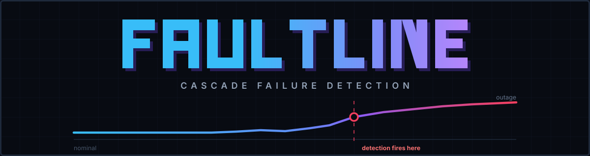
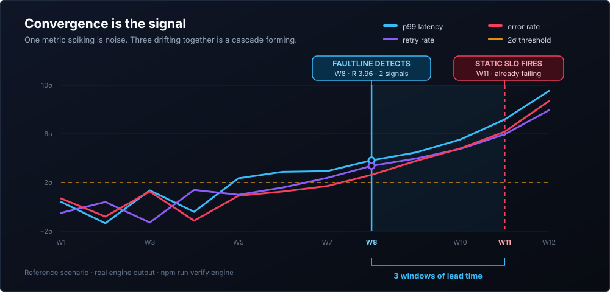
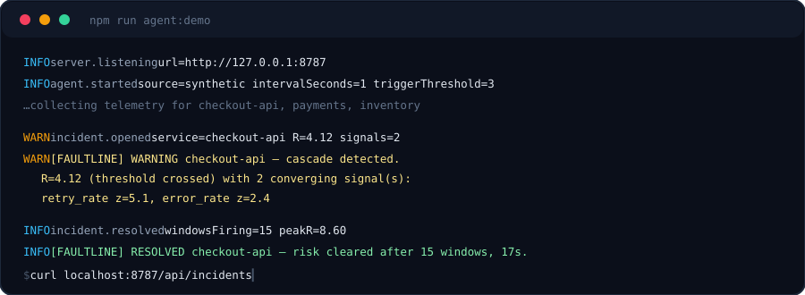
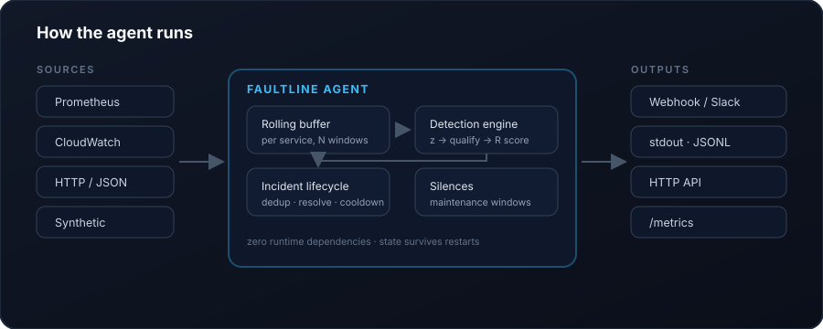

<p align="center">
  
</p>

<h3 align="center">Catch a service going wrong while there is still time to act</h3>

<p align="center"><em>Per-service multivariate drift triage: it shows you which metrics moved together, with auditable evidence, earlier than separate alerts would.</em></p>

<p align="center">
  <a href="https://github.com/Harshith029/faultline/actions/workflows/ci.yml"></a>
  <a href="LICENSE"></a>
  <a href="packages/agent/package.json"></a>
  
  
</p>

<p align="center">
  <a href="#see-it-detect-drift-in-30-seconds">Quickstart</a> ·
  <a href="#point-it-at-your-own-metrics">Configure</a> ·
  <a href="#how-detection-works">How it works</a> ·
  <a href="#does-it-actually-work">Benchmarks</a> ·
  <a href="docs/AGENT.md">Operations</a>
</p>

---

Static thresholds fire when you are already failing. FAULTLINE watches how latency, retries, and errors **drift together over time** and opens an incident while the failure is still forming — several windows before an SLO alert would trip.

<p align="center">
  
</p>

It is a real monitoring agent, not a dashboard: it runs continuously, pulls metrics from Prometheus / CloudWatch / any HTTP endpoint, scores multi-signal drift risk with auditable math, manages incident lifecycle with dedup and cooldown, and alerts your webhook.

**Zero runtime dependencies. Runs anywhere Node runs.**

> **Scope, stated plainly.** FAULTLINE evaluates each service independently against its own history. It has no dependency graph, no distributed tracing, and no deploy-event feed, so it cannot establish that one service caused a problem in another. It tells you *which metrics on a service moved together, and when* — earlier than three separate alerts would. Any cross-service ordering shown in the dashboard comes from the bundled demo scenario and is labelled as sample content. See [ARCHITECTURE.md](docs/ARCHITECTURE.md).

### Use it as a ranking signal first

The measured precision on real production telemetry is **~14%** ([docs/BACKTEST.md](docs/BACKTEST.md)) — about six false positives per true one. That is poor for waking someone at 3am and genuinely useful for answering *"where do I look first?"*, because a ranked list costs a glance to be wrong about where a page costs a night.

```bash
curl localhost:8787/api/ranking
```

```json
{ "triggerThreshold": 3, "evaluated": 3, "warmingUp": 0,
  "services": [
    { "rank": 1, "service": "checkout-api", "R_score": 7.16, "signal_count": 3, "firing": true },
    { "rank": 2, "service": "inventory",    "R_score": 0,    "signal_count": 0, "firing": false },
    { "rank": 3, "service": "payments",     "R_score": 0,    "signal_count": 0, "firing": false }
  ] }
```

Services still building a baseline rank last with a `null` score, never as low risk — "not yet known" and "known to be fine" are different answers. Wire the webhook to a pager only once you have tuned against your own traffic and are satisfied with the false-positive rate.

---

## See it detect drift in 30 seconds

```bash
git clone https://github.com/Harshith029/faultline.git
cd faultline
npm install
npm run agent:demo
```

The agent starts, streams synthetic telemetry for three services, and ~15 seconds in a multi-metric incident begins on `checkout-api`. You will see it caught live:

<p align="center">
  
</p>

While it runs, the agent is serving a real API:

```bash
curl localhost:8787/api/ranking     # services ordered by current risk — start here
curl localhost:8787/health          # liveness *and* telemetry validity, with freshness
curl localhost:8787/api/state       # current risk score per service
curl localhost:8787/api/incidents   # incident history
curl localhost:8787/metrics         # Prometheus exposition format
curl -X POST localhost:8787/api/inject?service=payments   # inject a fault on demand
```

Or with Docker. A container has to bind `0.0.0.0` inside its own network
namespace for a published port to reach it, so a token is required — the agent
will not start without one. Compose publishes to `127.0.0.1` only:

```bash
FAULTLINE_API_TOKEN=$(openssl rand -hex 32) docker compose up
```

---

## Point it at your own metrics

Everything is driven by one config file. Copy [`packages/agent/faultline.config.example.json`](packages/agent/faultline.config.example.json) and edit the `source` block.

**Prometheus / Thanos / Mimir / VictoriaMetrics**

```json
{
  "source": {
    "type": "prometheus",
    "options": {
      "url": "http://prometheus:9090",
      "serviceLabel": "service",
      "queries": {
        "p99_latency": "histogram_quantile(0.99, sum(rate(http_request_duration_seconds_bucket[1m])) by (le, service)) * 1000",
        "retry_rate":  "sum(rate(http_client_retries_total[1m])) by (service) / clamp_min(sum(rate(http_requests_total[1m])) by (service), 1) * 100",
        "error_rate":  "sum(rate(http_requests_total{status=~\"5..\"}[1m])) by (service) / clamp_min(sum(rate(http_requests_total[1m])) by (service), 1) * 100"
      }
    }
  }
}
```

**Your own metrics, not just these three.** Latency/retries/errors are only the defaults. The engine is metric-agnostic — give it any numeric signals your system emits:

```json
{
  "detector": {
    "metrics": ["queue_depth", "consumer_lag", "gc_pause_ms"],
    "minSignals": 2,
    "sigmaFloorAbs": { "queue_depth": 50, "consumer_lag": 100, "gc_pause_ms": 5 }
  }
}
```

Convergence scoring works identically: any two of those drifting together opens an incident.

**Different services, different rules.** A checkout API and a nightly batch job should not share a threshold, so any detector parameter can be overridden per service. Exact names beat wildcards, and the first matching wildcard wins:

```json
"services": [
  { "match": "checkout-api", "name": "tier-1", "criticalityWeight": 3, "triggerThreshold": 2.5 },
  { "match": "queue-*", "metrics": ["queue_depth", "consumer_lag"] },
  { "match": "batch-*", "minSustain": 4, "triggerThreshold": 6 }
]
```

`GET /api/state` reports which profile matched each service, so you can tell at a glance whether a rule is actually in effect.

**Mute it during a deploy.** Silences suppress paging without stopping detection — the risk score stays visible and the incident is still recorded, so postmortems keep the data. Recurring maintenance windows live in config; ad-hoc ones go through the API, because during an incident you can't restart the agent to mute it:

```bash
curl -X POST localhost:8787/api/silences \
  -H 'Content-Type: application/json' \
  -d '{"match":"checkout-*","until":"2026-03-05T14:00:00Z","reason":"deploy 42"}'
```

If an incident opens while muted and is *still firing* when the window ends, it pages then rather than being lost.

**Missing telemetry is never treated as good telemetry.** A sample is accepted only if every configured metric is present and finite. If a metric is absent, null, or unparseable, the whole sample is rejected and counted — it is not coerced to `0`. That coercion is the failure mode this guards: lose your error-rate series and a zero-filled sample reads as a flawless 0% error rate, which suppresses the convergence requirement and can mute a live incident while the agent still reports healthy.

`/health` therefore answers two separate questions:

```json
{
  "status": "degraded",
  "reasons": ["telemetry_stale"],
  "lastDataAt": "2026-08-10T05:02:00.000Z",
  "secondsSinceData": 420,
  "noDataGraceSeconds": 300,
  "consecutiveEmptyCollections": 7,
  "incompleteSamples": 3
}
```

A collection that succeeds but returns nothing is counted as empty, not as a healthy tick, and after `detector.noDataGraceSeconds` (default 300) the agent reports `degraded` with a 503. A previously healthy service that becomes stale also degrades `/health`, even if another service is still reporting. Freshness follows the telemetry sample timestamp rather than collection time, so replayed old samples cannot keep monitoring green. `faultline_telemetry_healthy`, `faultline_seconds_since_data`, `faultline_incomplete_samples_total`, and per-service `faultline_service_stale_seconds` are all exported, so an exporter that quietly stops looks like a problem rather than a quiet night.

**The API cannot be exposed unauthenticated.** It is open only when bound to loopback, which is what the quickstart does. Bind it anywhere else without a token and the agent **refuses to start** — `POST /api/silences` and `POST /api/inject` are a control plane, and a startup warning that still serves the request is not a control. Set a token to bind beyond localhost, with a separate read-only scope so Prometheus can scrape metrics without being able to silence your alerts:

```bash
export FAULTLINE_API_TOKEN=$(openssl rand -hex 32)
export FAULTLINE_READ_TOKEN=$(openssl rand -hex 32)
```

`GET /health` stays anonymous so load balancer probes keep working. TLS is built in (`server.tls`) and the agent refuses to start if a configured certificate is unreadable, rather than silently serving plaintext.

**Any HTTP endpoint you already have** — `mapping` renames incoming fields, so an existing internal metrics route usually needs no new code:

```json
{ "source": { "type": "http", "options": {
  "url": "https://internal.example/metrics.json",
  "mapping": { "service": "svc", "p99_latency": "latency_ms" }
}}}
```

**Amazon CloudWatch** (needs `npm install @aws-sdk/client-cloudwatch`):

```json
{
  "detector": { "metrics": ["p99_latency", "client_error_rate", "error_rate"] },
  "source": { "type": "cloudwatch", "options": {
    "region": "us-east-1",
    "namespace": "AWS/ApiGateway",
    "targets": [{ "service": "checkout-api", "dimensions": { "ApiName": "prod-api" } }]
  }}
}
```

The CloudWatch source emits `client_error_rate`, not `retry_rate`: API Gateway's
`4XXError` counts every client-side error — auth failures, malformed requests,
throttling — and is not a retry counter. If you have a real retry metric, map it
explicitly with `options.metrics`. The source checks its metric keys against
`detector.metrics` at startup and refuses to run if it cannot supply them, rather
than collecting forever and detecting nothing.

Then run it, with secrets supplied by the environment — never committed:

```bash
FAULTLINE_WEBHOOK_URL=https://hooks.slack.com/services/... \
  node packages/agent/bin/faultline.js start --config my-config.json
```

The webhook payload includes a `text` field, so Slack, Mattermost, and Discord accept it directly; everything else can read the structured `incident` object.

---

## How detection works

Three equations. No trained model in the detection path — every alert can be re-derived by hand.

**1. Normalize** — score each metric against its own recent baseline:

```
z = (value − mean) / standard_deviation
```

**2. Qualify** — a single bad window is noise; only sustained drift counts:

```
z ≥ 2.0  AND  persists for ≥ 2 consecutive windows
```

**3. Score & trigger** — converging signals compound risk:

```
R = mean_z × ln(1 + signal_count) × W      →  R ≥ 3.0 opens an incident
```

Because `ln(1 + n)` grows with the number of *converging* signals, three metrics at 3σ score far higher than one metric at 9σ. That is the whole thesis: **cascades announce themselves through convergence, not through any single number going red.**

On the bundled reference incident, detection fires **3 windows before** a static 2% error-rate SLO alert would — measured, not asserted: run `npm run verify:engine`.

### Incident lifecycle

Detection alone would page you every window. The agent adds the operational half:

| Behaviour | Why it exists |
|---|---|
| One incident per cascade, not one alert per window | Alert fatigue is how monitoring gets ignored |
| Resolves only after N consecutive clean windows | One good sample mid-incident means nothing |
| Cooldown after resolution | Stops a flapping service from paging all night |
| Notifier failures are isolated | A dead webhook must not stop detection |
| Source failures degrade `/health`, don't crash | Monitoring that dies during an outage is worthless |
| Restarts resume instead of re-warming | A rolling deploy shouldn't blind you for 12 minutes, or re-page an incident you already know about |

<p align="center">
  
</p>

---

## Does it actually work?

Two answers, and the honest one is second.

### On real production telemetry

`npm run backtest` replays the [Server Machine Dataset](https://github.com/NetManAIOps/OmniAnomaly) — 28 days of real server telemetry, 38 channels per machine, incidents labelled by the operators who ran the systems. Detection is replayed causally (no detector sees the future) across 41 labelled incidents on 4 machines, using **all 38 channels with no hand-picking**.

| Detector | Precision | Recall | F1 | False alerts |
|---|---:|---:|---:|---:|
| **FAULTLINE** | **14.1%** | 80.5% | **23.9%** | 544 |
| Sustained 3σ | 11.3% | 85.4% | 20.0% | 430 |
| Single metric 3σ | 7.3% | 97.6% | 13.5% | 1019 |

FAULTLINE wins on F1 and roughly doubles the precision of a single-metric threshold while nearly halving its false alerts — **and 14% precision is still too noisy to page a human unattended.** Both facts are true and neither is hidden.

A parameter sweep confirms this is not a tuning problem: precision never exceeds 16.5% at any threshold, and demanding more converging signals *lowers* it while destroying recall. Most false positives are real, sustained, multi-channel excursions that operators simply did not call incidents — deploys, batch jobs, capacity shifts. **Use it today as a triage and ranking signal, not as an unattended pager.** Full analysis, per-machine breakdown and the roadmap that would move the number: [docs/BACKTEST.md](docs/BACKTEST.md).

### On synthetic scenarios

`npm run benchmark` runs every detector against 12 labeled scenarios × 20 seeds — five cascades that **must** be caught, and seven adversarial non-incidents (single-window spikes, transient blips, deploy step-changes, 3× noise, seasonal load, organic growth) that **must not** page anyone.

⚠️ **These scenarios were designed from the same mental model as the detector, so they largely measure whether the implementation matches its own assumptions.** They are a regression test, not evidence of field performance — the real-world numbers above are ~6× worse. Read them as "does the math still behave as specified", nothing more.

The default and strict rows are the **agent's incremental rolling detector** — the
same `RollingDetector` the deployed agent runs, fed one window at a time so the
baseline ages out of a bounded buffer exactly as it does in production. The
fixed-baseline row is a reference variant that scores a whole series in one call
against a baseline that never moves. It is kept for comparison and is **not what
ships**; benchmarking only that variant would flatter the agent on precisely the
scenarios where it is weakest.

| Detector | Precision | Recall | F1 | Median delay |
|---|---:|---:|---:|---:|
| **FAULTLINE strict (agent, rolling)** | **82.6%** | **100%** | **90.5%** | +12w |
| FAULTLINE default (agent, rolling) | 69.4% | 100% | 82.0% | +10w |
| FAULTLINE fixed-baseline (reference, not deployed) | 69.4% | 100% | 82.0% | +10w |
| Sustained 3σ | 59.2% | 100% | 74.3% | +8w |
| Single metric 3σ | 35.5% | 66.0% | 46.2% | +6w |
| Static SLO (3×) | 33.3% | 3.0% | 5.5% | +15w |

Both FAULTLINE profiles catch **every** cascade in the suite. The static SLO baseline catches 3% — it is a lagging outcome metric, which is exactly the problem this project exists to address. Median lead over that baseline: **7 windows**.

The honest caveats, straight from the same run:

- **A blip that lasts exactly `minSustain` windows still fires** on the default profile (`transient-multi-spike`, 100%). The strict profile (`minSustain: 3`) drops that to 0% and is what you should run in noisy environments — it costs about one window of delay.
- **A permanent step change still alerts** (`deploy-step-change`, 100%). With a fixed baseline this is mathematically indistinguishable from a real cascade. The agent's rolling baseline absorbs it over time, but you will get an alert first. Arguably correct — a deploy that permanently moves all three metrics is worth knowing about — but it is a false positive against the label, so it is reported as one.
- **Sustained 3σ fires ~2 windows earlier** than FAULTLINE and catches everything too. It is simply far noisier (59.2% vs 83.3% precision). Speed is not free.

## Use it as a library

The engine is a dependency-free ES module ([`@faultline/core`](packages/core/detectionEngine.js)):

```js
import { runDetection, compareDetectors } from '@faultline/core'

const result = runDetection(windows)  // [{ window_number, p99_latency, retry_rate, error_rate }, ...]
result.detectionWindow                // first window where R crossed the threshold
compareDetectors(result)              // lead time vs static-SLO and single-metric detectors
```

---

## The dashboard (optional)

```bash
npm run dashboard   # http://localhost:5173
```

An incident-analysis UI over the same engine: scrub a cascade window by window, watch each z-score get derived from raw values, compare lead time against baseline detectors, run counterfactual mitigations ("what if we had acted at W6?"), and drop in your own CSV. Useful for postmortems and for understanding the math — the agent is what runs in production.

---

## Configuration reference

| Key | Default | Notes |
|---|---|---|
| `source.type` | `synthetic` | `synthetic` · `prometheus` · `http` · `cloudwatch` |
| `detector.metrics` | latency/retry/error | Any numeric signals your source emits |
| `services[]` | `[]` | Per-service overrides of any detector parameter |
| `silences[]` | `[]` | Recurring maintenance windows (UTC); ad-hoc ones via API |
| `server.auth` | env-based | `FAULTLINE_API_TOKEN` (read+write), `FAULTLINE_READ_TOKEN` (read) |
| `server.tls` | `null` | `certFile` + `keyFile` for built-in HTTPS |
| `detector.minSignals` | `2` | Qualified signals required to trigger — enforces convergence |
| `detector.intervalSeconds` | `60` | Collection cadence |
| `detector.historyWindows` | `40` | Rolling buffer size per service |
| `detector.baselineWindows` | `10` | Oldest N windows form the baseline |
| `detector.zThreshold` | `2.0` | Sigma required to count as elevated |
| `detector.minSustain` | `2` | Consecutive windows required to qualify |
| `detector.triggerThreshold` | `3.0` | R at which an incident opens |
| `detector.sigmaFloorAbs` | `null` | Per-metric minimum sigma; stops quiet baselines inflating z |
| `alerting.cooldownSeconds` | `300` | Suppress re-opening after resolution |
| `alerting.resolveAfterWindows` | `3` | Clean windows required to resolve |
| `server.port` | `8787` | HTTP API |

Env overrides: `FAULTLINE_WEBHOOK_URL`, `FAULTLINE_PORT`, `FAULTLINE_HOST`, `FAULTLINE_LOG_LEVEL`, `FAULTLINE_INTERVAL_SECONDS`, `FAULTLINE_STORAGE_PATH`, `FAULTLINE_SOURCE_TYPE`.

Full operational detail: [docs/AGENT.md](docs/AGENT.md) · architecture: [docs/ARCHITECTURE.md](docs/ARCHITECTURE.md)

---

## Project layout

```
packages/core/      detection engine + CSV parser (zero deps, shared)
packages/agent/     the monitoring agent: sources, detector, alerting, API
frontend/dashboard/ incident-analysis UI (optional)
backend/lambda/     AWS Lambda variant for serverless deployments
docs/               architecture and operations
```

## Testing

```bash
npm test              # 264 tests across engine, agent, benchmark, dashboard
npm run verify:engine # reference cascade assertion
npm run benchmark     # synthetic precision/recall/lead time vs baselines
npm run fetch:dataset # download the Server Machine Dataset (not vendored)
npm run backtest      # replay real production telemetry
```

Covers the engine math, config validation, incident state machine, every telemetry source, the HTTP API, and end-to-end runs asserting that a cascade produces exactly one alert, reaches the webhook, persists, and resolves.

## Roadmap

Driven by what the [backtest](docs/BACKTEST.md) actually showed. Its first three items have all been tried and rejected on measurement: **change-point detection** made precision and recall worse; **per-channel learned thresholds** improved aggregate F1 while sending one machine in four completely blind; **robust median/MAD statistics** proved indistinguishable from mean/σ once alert volume was held constant (kept as an option, defaulted off).

Three refinements of *how the numbers are computed* changed nothing, which is itself the most useful result so far: on this data the limit is not statistical technique but that "two channels drifted up together" does not separate the excursions operators called incidents from the ones they did not. The remaining work that changes the *signal* rather than the arithmetic is correlation structure.

- **Change-point detection** — most false positives are level shifts, not drift. Recognizing "this is a new normal" would remove a whole class of them.
- **Per-channel learned thresholds** — one global `zThreshold` across heterogeneous channels is crude.
- **Seasonality awareness** — daily and weekly cycles currently look like drift.
- **Correlation-weighted convergence** — weight signals by whether those channels are *historically* coupled, separating genuine cascades from coincident movement.
- OpenTelemetry-native source and trace-derived dependency graphs
- Optional LLM explanation layer in the agent (already present in the AWS Lambda variant)

## Contributing

Issues, questions and PRs are welcome — see [CONTRIBUTING.md](CONTRIBUTING.md) for setup, repo layout, and the bar for detection changes.

One invariant: **detection stays deterministic and auditable — AI may explain a detection, never cause or suppress one.**

Detection-quality reports are the most valuable thing you can file. There is an [issue template](.github/ISSUE_TEMPLATE/detection_quality.yml) for them; attaching a CSV of the telemetry means the engine can be run on your data directly.

## Security

Found a vulnerability? Please report it privately — see [SECURITY.md](SECURITY.md), which also documents the attack surface, a hardening checklist, and the known limitations.

## Documentation

| Document | Contents |
|---|---|
| [docs/AGENT.md](docs/AGENT.md) | Operating the agent: tuning, silences, auth, restarts, failure modes |
| [docs/ARCHITECTURE.md](docs/ARCHITECTURE.md) | How the pieces fit and why they are built this way |
| [docs/BACKTEST.md](docs/BACKTEST.md) | Real-telemetry results, protocol, and three rejected ideas |
| [CONTRIBUTING.md](CONTRIBUTING.md) | Development setup and the bar for detection changes |
| [SECURITY.md](SECURITY.md) | Reporting, attack surface, hardening |

## License

[MIT](LICENSE) — use it, fork it, ship it.

<p align="center">
  
</p>

<p align="center">
  Built by <b>Pali Krishna Harshith</b> · Top 300 Finalist, AWS Builder Center AIdeas Challenge
</p>
